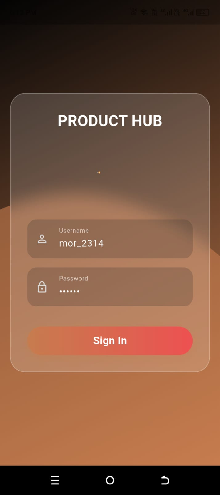
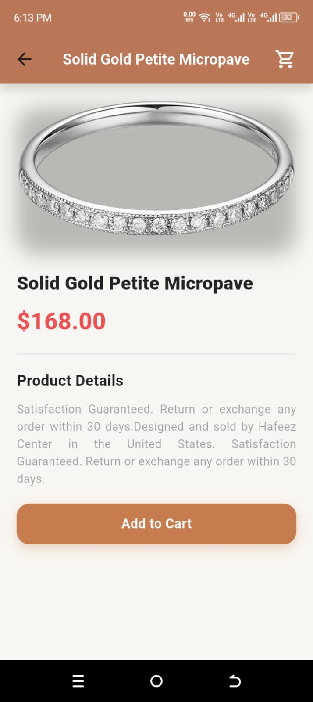
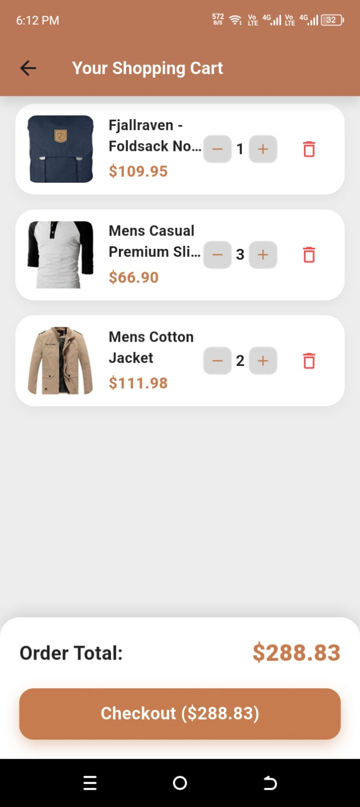

# 🛍️ E-Commerce Mobile Application

A modern, production-ready Flutter e-commerce application built with Clean Architecture principles, featuring user authentication, product browsing, detailed product views, and a fully functional shopping cart. This project demonstrates advanced mobile development practices, scalable code organization, and professional software engineering standards.

## 📱 Project Overview

This Flutter application showcases a complete e-commerce experience with seamless user authentication, intuitive product discovery, and efficient cart management. Built following Clean Architecture with a feature-first approach, the app demonstrates separation of concerns, testability, and maintainability at scale. The implementation leverages modern Flutter 3.x capabilities, Material Design 3 components, and industry-standard state management patterns to deliver a polished, performant mobile experience.

## ✨ Key Features

- **🔐 User Authentication** - Secure login system with proper state management
- **🛒 Product Catalog** - Browse products with beautiful, responsive UI
- **📦 Product Details** - Comprehensive product information and images
- **🛍️ Shopping Cart** - Add, manage, and view items in your cart
- **🎨 Modern UI/UX** - Material Design 3 with custom theming
- **🏗️ Clean Architecture** - Feature-first structure with clear separation of concerns
- **📡 RESTful API Integration** - Seamless data fetching from external APIs
- **⚡ State Management** - Efficient state handling with Provider pattern

## 🖼️ Screenshots

<div align="center">
  <h3>Key App Screens</h3>
  
  <table>
    <tr>
      <td align="center">
        
        <br />
        <b>Login</b>
      </td>
      <td align="center">
        
        <br />
        <b>Home / Products</b>
      </td>
      <td align="center">
        
        <br />
        <b>Product Details</b>
      </td>
      <td align="center">
        
        <br />
        <b>Shopping Cart</b>
      </td>
    </tr>
  </table>
</div>

## 🛠️ Technologies & Tools

### Core Framework
- **Flutter 3.x** - Cross-platform mobile development framework
- **Dart 3.9.2+** - Programming language

### State Management
- **Provider 6.1.5+** - State management solution for Flutter

### Networking & Data
- **Dio 5.3.3** - Powerful HTTP client for API communication
- **Equatable 2.0.5** - Value equality for Dart objects

### Dependency Injection
- **GetIt 7.6.4** - Service locator for dependency injection

### UI & Animations
- **Lottie 2.7.0** - Beautiful animations and illustrations
- **Material Design 3** - Modern design system

### Development Tools
- **Flutter Lints 5.0.0** - Official lint rules for Flutter
- **Dart Analysis** - Code quality and static analysis

## 📁 Project Structure

This project follows **Clean Architecture** principles with a **feature-first** folder structure, ensuring scalability, maintainability, and testability.

```
lib/
├── core/                          # Shared utilities and configurations
│   ├── assets/                    # Fonts and static assets
│   │   └── fonts/                 # Custom font families (Poppins, Montserrat)
│   ├── constant/                  # App-wide constants
│   │   ├── assets.dart            # Asset path constants
│   │   └── colors.dart             # Color palette definitions
│   ├── errors/                     # Error handling
│   │   ├── exceptions.dart        # Custom exceptions
│   │   └── failures.dart          # Failure classes
│   ├── extension/                 # Dart extensions
│   │   └── size-extension.dart     # Responsive sizing utilities
│   └── network/                   # Network layer
│       ├── api_service.dart       # API service configuration
│       ├── network_dio.dart       # Dio instance setup
│       └── network_info.dart      # Network connectivity checker
│
├── features/                      # Feature modules (feature-first architecture)
│   ├── auth/                      # Authentication feature
│   │   ├── data/                  # Data layer
│   │   │   ├── model/             # Data models (DTOs)
│   │   │   ├── repositoryImp/    # Repository implementations
│   │   │   └── source/            # Remote/local data sources
│   │   ├── domain/                # Domain layer (business logic)
│   │   │   ├── entities/          # Domain entities
│   │   │   ├── repository/        # Repository interfaces
│   │   │   └── usecase/           # Use cases
│   │   └── presentation/          # Presentation layer
│   │       ├── pages/             # Full page widgets
│   │       ├── provider/          # State management
│   │       └── widgets/           # Feature-specific widgets
│   │
│   ├── products/                  # Products feature
│   │   ├── data/
│   │   │   ├── model/
│   │   │   ├── repositoryImp/
│   │   │   └── source/
│   │   ├── domain/
│   │   │   ├── entities/
│   │   │   ├── repository/
│   │   │   └── usecase/
│   │   └── presentation/
│   │       ├── pages/
│   │       ├── provider/
│   │       └── widgets/
│   │
│   ├── cart/                      # Shopping cart feature
│   │   ├── data/
│   │   ├── domain/
│   │   └── presentation/
│   │
│   └── users/                     # User management feature
│       ├── data/
│       ├── domain/
│       └── presentation/
│
└── main.dart                      # Application entry point
```

### Architecture Layers Explained

#### 🎯 **Data Layer** (`data/`)
- **Models**: Data Transfer Objects (DTOs) for API responses
- **Repository Implementations**: Concrete implementations of domain repositories
- **Data Sources**: Remote (API) and local (cache/database) data sources

#### 🧠 **Domain Layer** (`domain/`)
- **Entities**: Pure Dart classes representing business objects
- **Repository Interfaces**: Contracts defining data operations
- **Use Cases**: Business logic operations (single responsibility)

#### 🎨 **Presentation Layer** (`presentation/`)
- **Pages**: Full-screen widgets (screens)
- **Widgets**: Reusable UI components
- **Providers**: State management logic

## 🚀 Getting Started

### Prerequisites

- Flutter SDK 3.x or higher
- Dart SDK 3.9.2 or higher
- Android Studio / VS Code with Flutter extensions
- Android SDK (for Android development)
- Xcode (for iOS development, macOS only)

### Installation

1. **Clone the repository**
   ```bash
   git clone https://github.com/humzamajeed/Mobile-Computing-Assignment-2.git
   cd Mobile-Computing-Assignment-2
   ```

2. **Install dependencies**
   ```bash
   flutter pub get
   ```

3. **Run the application**
   ```bash
   flutter run
   ```

### Build for Production

**Android:**
```bash
flutter build apk --release
# or
flutter build appbundle --release
```

**iOS:**
```bash
flutter build ios --release
```

## 🏗️ Architecture Highlights

### Clean Architecture Benefits
- ✅ **Separation of Concerns**: Each layer has a single, well-defined responsibility
- ✅ **Testability**: Business logic is independent of UI and data sources
- ✅ **Maintainability**: Changes in one layer don't affect others
- ✅ **Scalability**: Easy to add new features without breaking existing code
- ✅ **Reusability**: Domain logic can be reused across different platforms

### State Management Pattern
The app uses **Provider** pattern for state management:
- `ChangeNotifierProvider` for managing app-wide state
- `Consumer` widgets for listening to state changes
- Separation of business logic from UI components

### API Integration
- Uses **Dio** for HTTP requests
- Integrates with [FakeStoreAPI](https://fakestoreapi.com/) for product data
- Proper error handling and timeout management
- Repository pattern for data abstraction

## 📝 Code Quality

- ✅ Follows Flutter and Dart best practices
- ✅ Comprehensive error handling
- ✅ Responsive design with custom extensions
- ✅ Custom color palette and theming
- ✅ Clean code principles (SOLID, DRY, KISS)
- ✅ Proper naming conventions (PascalCase for classes, snake_case for files)

## 🧪 Testing

Run tests with:
```bash
flutter test
```

## 📦 Dependencies

Key dependencies are listed in `pubspec.yaml`:
- `flutter` - Flutter SDK
- `provider` - State management
- `dio` - HTTP client
- `get_it` - Dependency injection
- `equatable` - Value equality
- `lottie` - Animations

## 🤝 Contributing

This is a portfolio project, but suggestions and improvements are welcome!


This project is part of a portfolio and is available for review purposes.

## 👨‍💻 Author
Muhammad Humza Majeed

Built  using Flutter

---

**Note**: This application uses the [FakeStoreAPI](https://fakestoreapi.com/) for demonstration purposes. In a production environment, you would integrate with your own backend services.
